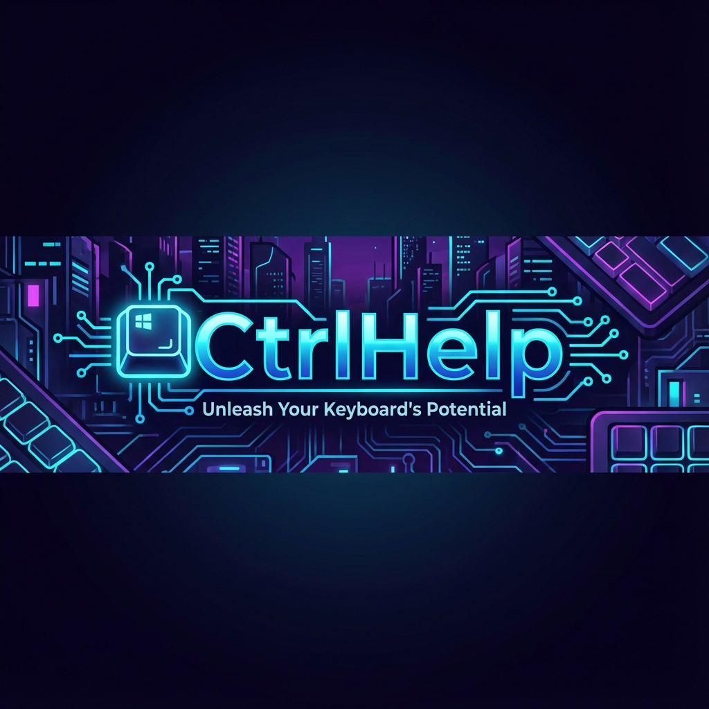

<p align="center">
  
</p>

<p align="center">
  <a href="LICENSE">
    
  </a>
  <a href="https://github.com/bahattinyunus/CtrlHelp/actions">
    
  </a>
  <a href="https://github.com/bahattinyunus/CtrlHelp/issues">
    
  </a>
  <a href="https://github.com/bahattinyunus/CtrlHelp/stargazers">
    
  </a>
</p>

# CtrlHelp

**Unleash Your Keyboard's Potential**

Welcome to the **CtrlHelp** repository! This project is a comprehensive suite of tools designed to help you master keyboard shortcuts, improve accessibility, and boost your productivity across Windows and the Web.

## 📂 Project Structure

This repository is organized into three main components:

| Component | Description | Path |
| :--- | :--- | :--- |
| **CtrlHelp App** | The core UWP application that provides an interactive overlay for learning shortcuts. | [`📂 CtrlHelpApp`](./CtrlHelpApp) |
| **Desktop App** | The Electron-based desktop version for cross-platform compatibility and rapid feature deployment. | [`📂 DesktopApp`](./DesktopApp) |
| **Web & Localization** | Web assets and localization files, including support for Turkish users. | [`📂 CtrlHelpTR`](./CtrlHelpTR) |

## 🏗️ Architecture

The following diagram illustrates the high-level architecture of the CtrlHelp ecosystem:

```mermaid
graph TD
    User([👤 User]) -->|Interacts with| Repo[📂 CtrlHelp Repository]
    Repo -->|Native Performance| UWP[🖥️ CtrlHelp App (UWP)]
    Repo -->|Cross-Platform| Electron[⚡ Desktop App (Electron)]
    Repo -->|Accessibility| Web[🌐 CtrlHelp Web (PWA)]
    
    UWP -->|Distribution| MS[🛍️ Microsoft Store]
    Electron -->|Builds| Exe[📦 Windows Installer]
    Web -->|Localization| TR[🇹🇷 Turkish Language Support]
    
    style User fill:#f9f,stroke:#333,stroke-width:2px
    style Repo fill:#bbf,stroke:#333,stroke-width:2px
    style UWP fill:#bfb,stroke:#333,stroke-width:2px
    style Electron fill:#fbf,stroke:#333,stroke-width:2px
```

## 🚀 Features & Capabilities

### 🎮 Gamified Practice Mode
Transform the way you learn shortcuts. Instead of rote memorization, play through levels that challenge your recall speed for apps like:
- **Adobe Creative Cloud** (Photoshop, Illustrator, Premiere)
- **Developer Tools** (VS Code, IntelliJ, Git)
- **Productivity** (Excel, Word, Slack)

### ⌨️ Interactive Shortcut Overlay
Never get stuck again.
1. Hold the `Ctrl` key for 2 seconds.
2. A beautiful, non-intrusive overlay appears.
3. Browse valid shortcuts for the currently active window.
4. Release to dismiss.

### 🛠️ Built With
We utilize cutting-edge technologies to deliver a smooth experience:

| Component | Technology Stack |
| :--- | :--- |
| **Core App** | UWP (Universal Windows Platform), C# |
| **Desktop App** | Electron, Node.js, HTML5, CSS3 |
| **Styling** | Modern CSS Grid, Flexbox, Dark Mode Variables |
| **Distribution** | Microsoft Store, electron-builder |

## 📥 Installation & Usage

### Option 1: Microsoft Store (Recommended)
The easiest way to get the full Native experience.
1. Visit the [Microsoft Store Page](https://apps.microsoft.com/detail/CtrlHelp/9mvpjxnskdrr?mode=full).
2. Click **Install**.
3. Launch via Start Menu.

### Option 2: Run Electron Desktop App Locally
For developers or those preferring the portable version:
```bash
# Clone the repository
git clone https://github.com/bahattinyunus/CtrlHelp.git

# Go to the Desktop App directory
cd CtrlHelp/DesktopApp

# Install dependencies
npm install

# Start the application
npm start
```

## 🤝 Contributing

We welcome contributions! Please read our [CONTRIBUTING.md](CONTRIBUTING.md) for details on our code of conduct, and the process for submitting pull requests.

## 📜 License

This project is licensed under the MIT License - see the [LICENSE](LICENSE) file for details.

---

<p align="center">
  <sub>Built with ❤️ by Bahattin Yunus. Empowering users, one keystroke at a time.</sub>
</p>
